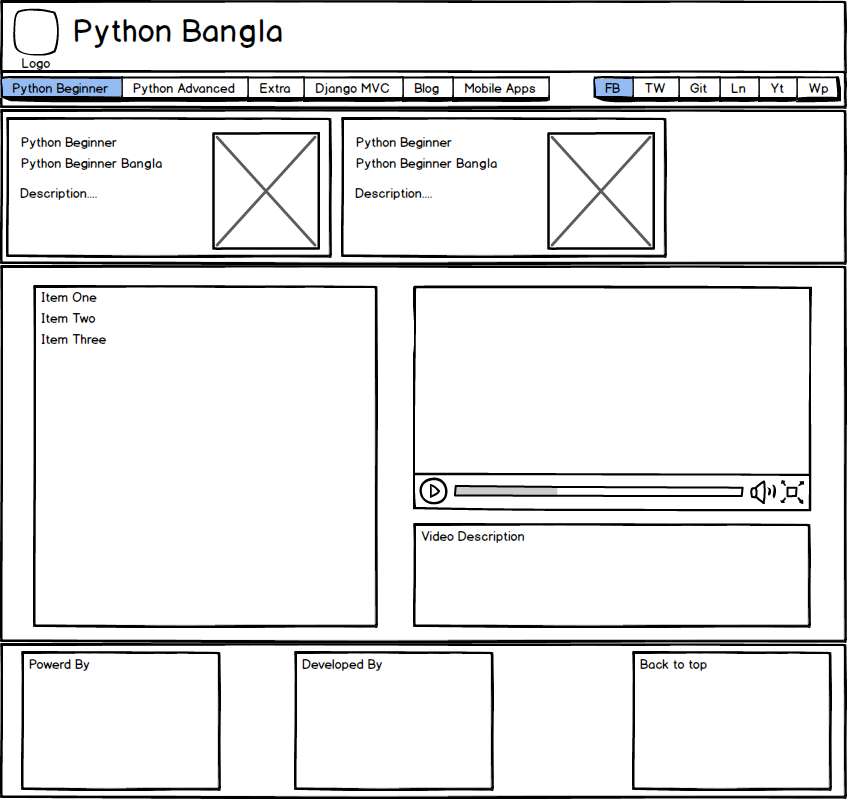
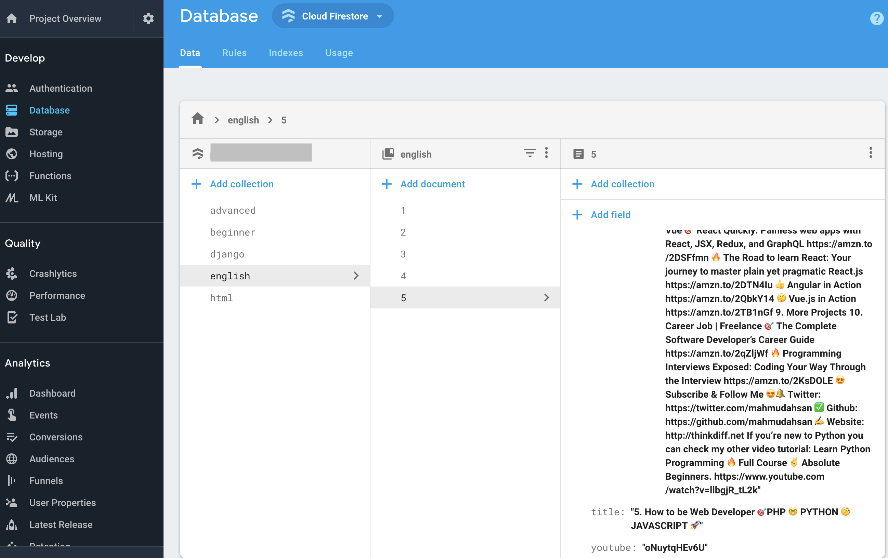
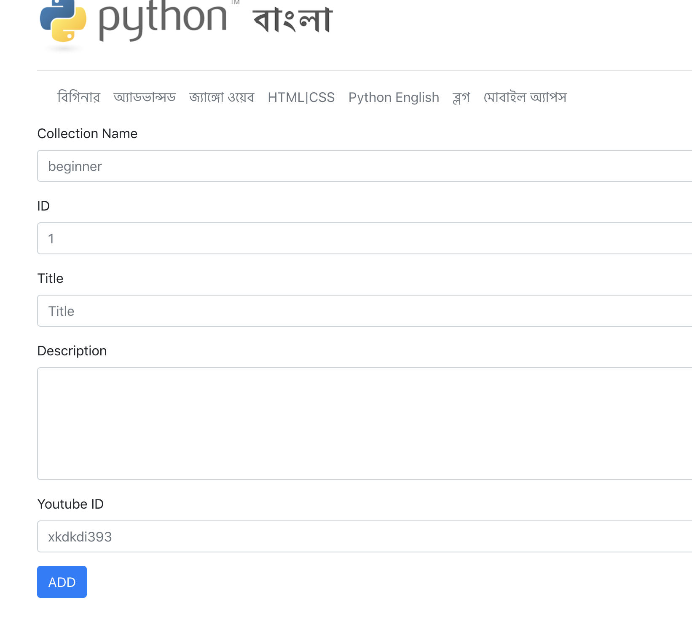

<p align="center">
    <a href="/">
        
    </a>
    <a href="https://reactjs.org">
        
    </a>
    <a href="https://firebase.google.com">
        
    </a>
    <a href="https://github.com/mahmudahsan/python-bangla-react/blob/master/LICENSE">
        
    </a>
    <a href="https://twitter.com/mahmudahsan">
        
    </a>
</p>


# Single Page React Web App

Demo 1: https://flutterbook.net
Demo 2: https://pythonbangla.com

I redevelop my original Python Django Framework based project [PythonBangla](https://github.com/mahmudahsan/pythonbangla.com) to Reactjs and firebase based project. During the making of this project, I updated the UI a bit. 

For last 6 months, I was learning ReactJs library. I wanted to develop something else. But before developing my other big project, I thought lets rebuild my original django project so that I can test how good I understand React, Firebase Cloud Firestore (NoSQL) etc.

I develop this project in 5 days by my part time effort. Also this project is just for exploring my knowledge, so I didn't invest more time to add more features, like a proper admin panel etc. 

Demo 1: 😎 [http://pythonbangla.com/](http://pythonbangla.com/) | Source Code: [Github React](https://github.com/mahmudahsan/python-bangla-react)

Demo 2: 🤓 [Django + PostgreSQL + Heroku](https://pb-947583-bn474.herokuapp.com) | Source Code: [Github Django](https://github.com/mahmudahsan/pythonbangla.com)


<p align="center">
    
</p>

<p align="center">
    
</p>

<p align="center">
    
</p>


# Table of Contents

- [Python Bangla React](#python-bangla-react)
- [Table of Contents](#table-of-contents)
  - [Technology Used](#technology-used)
  - [Features](#features)
  - [Setup in local machine](#setup-in-local-machine)
  - [Setup Firebase](#setup-firebase)
  - [Deploy in Firebase Hosting](#deploy-in-firebase-hosting)
  - [Contribution](#contribution)
  - [Questions or feedback?](#questions-or-feedback)

## Technology Used
1. [React](https://reactjs.org/)
2. [Firebase](https://firebase.google.com/)
3. [Bootstrap](https://getbootstrap.com/)
4. [JQuery](https://jquery.com/)
5. [Linkyfy](https://github.com/cowboy/javascript-linkify)


## Features
I just want to showcase my youtube tutorials in nice way. Also this site helps SEO in Google Search Engine. 

## Setup in local machine
1. First clone this project in your local machine.
2. In the frontend directory all the source code are exists.
3. Modify `frontend/config/Setting.js` and update all the info

## Setup Firebase
1. Create a project in [Firebase](https://firebase.google.com/
)
2. Now follow this tutorial and get your project configuration [Firebase How To](https://firebase.google.com/docs/database/web/start)
3. Now update `frontend/Model/firebaseauth.js` file by your project info

```javascript
// Firebase Authentication Replace with your data

import Firebase from 'firebase';

const config = {
  apiKey: "sxxxx",
  authDomain: "ssss",
  databaseURL: "xxxx",
  projectId: "xxxx",
  storageBucket: "xxxx",
  messagingSenderId: "xxx"
};

export default Firebase.initializeApp(config);
```
4. Our data will be look like this on firebase
<p align="center">
    
</p>

If we compare this with relational database, then collections are table name and document are each row of item in table.

5. In Firebase Cloud Firestore the rules should be look like this. As your project need to add data, so you open public write/read. When your writing task complete, just remove the `write` part
```
service cloud.firestore {
  match /databases/{database}/documents {
    match /{document=**} {
      allow read, write; 
    }
  }
}
```

6. Now add `<Route path="/admin" component={FirebaseForm} />` this code in `frontend/Router/AppRouter.js`

```javascript
<Switch>
    ....
    <Route path="/admin" component={FirebaseForm} />
    <Route component={NotFoundPage} />
</Switch>
```

Also add `import FirebaseForm from '../components/FirebaseForm';` this code at the top of the `frontend/Router/AppRouter.js`

7. If you save all of this, and run `yarn start` in terminal you can visit `http://localhost:3000/admin` where you can add your contents to firebase

<p align="center">
    
</p>

8. IMPORTANT: When you will deploy your project, undo the AppRouter.js modification as before. Because if you deploy this admin panel to add data, anyone can alter your database by using this form. In my case, I didn't deploy this route in production.

## Deploy in Firebase Hosting
1. Run `yarn build` it will create a build folder with production files

2. Now follow [Create React App Firebase Hosting](https://facebook.github.io/create-react-app/docs/deployment#firebase-https-firebasegooglecom) to deploy your project in firebase

3. firebase deploy --project PROJECT_ID

## Contribution
If you want to contribute on this project, you're welcome to fork the project and submit a pull request. 

## Questions or feedback?

Feel free to open an issue, or find me [@mahmudahsan on Twitter](https://twitter.com/mahmudahsan).
